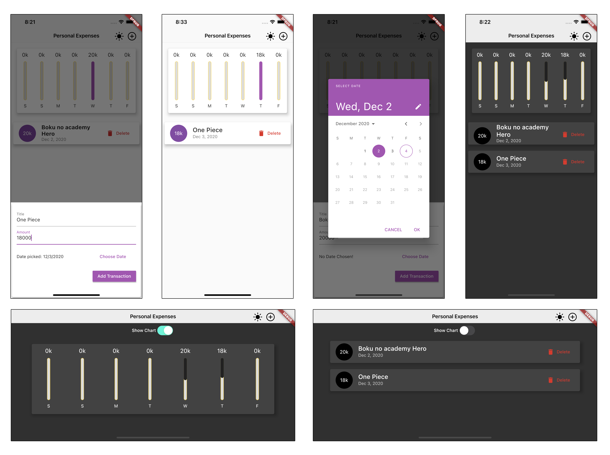

### **Flutter Personal Expenses App - Learn Flutter**

A Flutter Demo App To Record Personal Expenses And See Trends In Spending Over Time Via A Chart.

#Features:

1. Switch in real-time between light mode and dark mode - persists preference across app restarts.
2. Responsive to landscape and portrait modes.
3. When in landscape mode, can switch between showing chart or expenses list.
4. Adaptive interface that changes buttons and toolbar depending on whether the user is on Android or IOS.

# Demo

# Code Dependencies
If you wish to run this code on your local machine, Flutter needs to be installed.

See instructions [here](https://flutter.dev/docs/get-started/install "here") for your operating system.

###End
